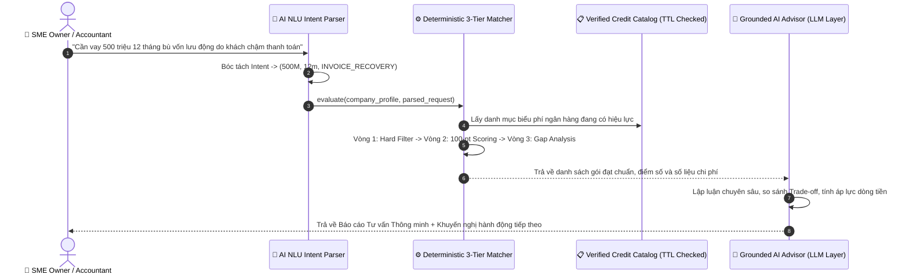

# Lotus Fin — Module AI005: AI Financing Decision Support & 9 KPIs What-if Engine

> **Phiên bản:** 1.1 — 2026-09-30  
> **Phân hệ:** Lotus Fin AI Capabilities · Topic E (FinTechathon 2026)  
> **Kiến trúc:** Bounded AI Copilot (NLU Intent Parser + Grounded LLM Advisor + Deterministic Matcher)  
> **Chính sách kiểm soát bảo mật:** `R4/R5 bank-write = OFF` · `data_mode = simulation`

---

## 1. Vai trò của AI trong Phân hệ `AI-F005` Financing Decision Support

Theo đặc tả sản phẩm của Lotus Fin, **AI không phải là chiếc hộp đen tự ý quyết định duyệt vay hay bịa đặt số liệu**, mà đóng vai trò là một **Financial Copilot thông minh** với 3 nhiệm vụ AI rõ ràng:

1. **NLU Intent & Parameter Extraction (Hiểu ngôn ngữ tự nhiên):**
   * Cho phép chủ doanh nghiệp SME hoặc kế toán trưởng nhập câu hỏi tự do bằng tiếng Việt/tiếng Anh (VD: *"Công ty tôi đang bị khách hàng chậm trả tiền 15 ngày, cần vay tầm 500 triệu trong 6 tháng để trả lương và xoay vòng vốn..."*).
   * AI tự động bóc tách thành các tham số định kiểu: `amount: 500,000,000 VND`, `term_months: 6`, `purpose: INVOICE_RECOVERY`.

2. **Grounded AI Reasoning & Multi-Option Synthesis (Lập luận & So sánh đa phương án có căn cứ):**
   * Sau khi **Deterministic 3-Tier Matcher** tính toán ra các gói vay thỏa mãn điều kiện cứng và chấm điểm 100 điểm, **AI Advisor** sẽ tiến hành:
     - **Executive Summary:** Tóm lược báo cáo phân tích tài chính dành cho Giám đốc/CFO.
     - **Top Recommendation Analysis:** Lập luận lý do tại sao gói Top 1 được chọn dựa trên chỉ số DSCR, quy mô doanh thu và nhu cầu vốn.
     - **Trade-off Comparison:** So sánh đánh đổi đa chiều giữa Lựa chọn 1 và Lựa chọn 2/3 (Chi phí lãi vay vs Tốc độ giải ngân vs Yêu cầu tài sản bảo đảm).
     - **Cashflow Impact Warning:** Cảnh báo áp lực dòng tiền chi trả gốc/lãi hàng tháng lên số dư tiền mặt thực tế.
     - **Actionable Next Steps:** Đưa ra các khuyến nghị hành động an toàn tiếp theo (chuyển sang chạy mô phỏng lịch trả nợ `AI-F006` hoặc chuẩn bị hồ sơ).

3. **Strict Numeric Grounding & Safety Guardrail:**
   * Mọi con số (lãi suất, số tiền, ngày giải ngân) xuất hiện trong văn bản phân tích của AI **bắt buộc phải trùng khớp 100%** với số liệu do Deterministic Engine tính toán.
   * Tự động lọc các canary prompt injection và tuân thủ chính sách `R4/R5 bank-write = OFF` (Không gửi hồ sơ vay đến ngân hàng, không hứa hẹn cam kết duyệt vay).

---

## 2. Sơ đồ Luồng Xử lý AI Copilot



---

## 3. Cấu trúc Thư mục Module `AI005`

```
lotus_fin/lotus_fin/AI005/
├── __init__.py           # Package interfaces & API exports
├── ai_advisor.py         # AI NLU Intent Parser & Grounded LLM Advisor (Multi-provider)
├── models.py             # Data models & 9 KPIs Layer schemas
├── catalog.py            # Danh mục biểu phí tín dụng SME Việt Nam (VPBank, TCB, VCB, BIDV, TPBank)
├── matcher.py            # Deterministic 3-Tier Matching Engine
├── scenario_engine.py    # What-if Simulation Engine chuẩn hóa 9 KPIs Layer
├── service.py            # Service Layer & Frappe Whitelisted REST Endpoints
├── test_ai005.py         # Test suites tự động (NLU, AI Advisor, Matcher, 9 KPIs)
└── README.md             # Tài liệu đặc tả và hướng dẫn
```

---

## 4. Hướng dẫn Sử dụng AI Copilot

### 4.1. Sử dụng qua Python SDK
```python
from lotus_fin.AI005 import FinancingService

service = FinancingService(ai_provider="mock")

# Hỏi AI Copilot bằng ngôn ngữ tự nhiên
response = service.ask_financing_copilot(
    company="An Phu Trading Ltd",
    user_query="Công ty tôi cần vay 500 triệu trong 12 tháng để bổ sung vốn lưu động do khách hàng chậm thanh toán"
)

# Kết quả phân tích NLU
print("Ý định NLU bóc tách:", response["parsed_intent"])

# Kết quả tư vấn từ AI Advisor
ai_advice = response["ai_advice"]
print("\n--- EXECUTIVE SUMMARY ---")
print(ai_advice["executive_summary"])

print("\n--- PHÂN TÍCH GÓI VAY TOP 1 ---")
print(ai_advice["top_recommendation"])

print("\n--- SO SÁNH ĐÁNH ĐỔI (TRADE-OFFS) ---")
print(ai_advice["tradeoff_comparison"])

print("\n--- CẢNH BÁO DÒNG TIỀN ---")
print(ai_advice["cashflow_impact_warning"])
```

### 4.2. Gọi qua REST API (Frappe Whitelist)

* **Endpoint AI Copilot:**
  `POST /api/method/lotus_fin.AI005.service.ask_copilot`
  ```json
  {
    "company": "An Phu Trading Ltd",
    "query": "Tôi muốn tìm gói vay 300 triệu trong 6 tháng lãi suất thấp nhất để trả lương nhân viên"
  }
  ```

---

## 5. Chạy Kiểm thử Tự động (Unit Tests)

```powershell
$env:PYTHONPATH="M:\lotus-fin-docs-kien-security-documentation-set\lotus-fin-docs-kien-security-documentation-set\lotus_fin"
python -m unittest lotus_fin.AI005.test_ai005
```

Kết quả:
```
.......
----------------------------------------------------------------------
Ran 7 tests in 0.009s

OK
```
